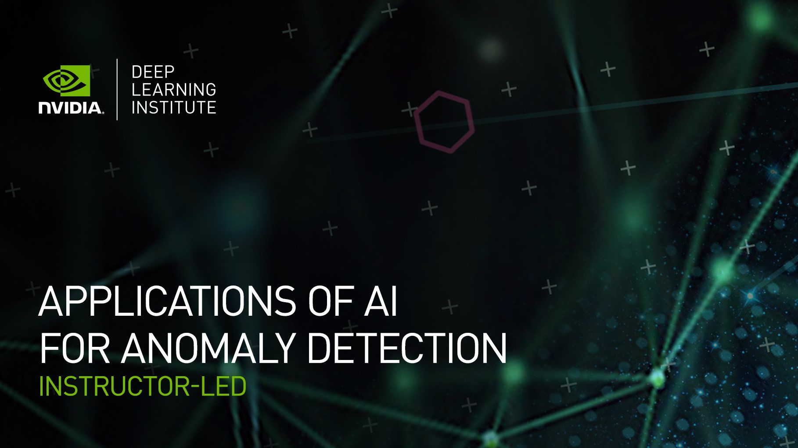

## Table of Contents
1. [Description](#description)
2. [Information](#information)
3. [File descriptions](#files)
4. [Certificate](#certificate)

## Description

Whether your organization needs to monitor cybersecurity threats, fraudulent financial transactions, product defects, or equipment health, artificial intelligence can help catch data abnormalities before they impact your business. AI models can be trained and deployed to automatically analyze datasets, define “normal behavior,” and identify breaches in patterns quickly and effectively. These models can then be used to predict future anomalies. With massive amounts of data available across industries and subtle distinctions between normal and abnormal patterns, it’s critical that organizations use AI to quickly detect anomalies that pose a threat.

In this workshop, we learned how to identify anomalies and failures in time-series data, estimate the remaining useful life of the corresponding parts, and map anomalies to failure conditions. More specifically, how to prepare time-series data for AI model training, develop an XGBoost ensemble tree model, build a deep learning model using a long short-term memory (LSTM) network, and create an autoencoder that detects anomalies for predictive maintenance. At the end of the workshop, we are able to use AI to estimate the condition of equipment and predict when maintenance should be performed.

## Information

The overall goals of this course were the following:
> - Prepare data and build, train, and evaluate models using XGBoost, autoencoders, and GANs;
> - Detect anomalies in datasets with both labeled and unlabeled data;
> - Classify anomalies into multiple categories regardless of whether the original data was labeled.

More detailed information and links for the course can be found on the [course website](https://www.nvidia.com/en-us/training/instructor-led-workshops/anomaly-detection/).

## File descriptions

The description of the files in this repository can be found bellow:
- 1 - Anomaly Detection in Network Data Using GPU-Accelerated XGBoost:
  - [Lab1-Anomaly Detection in Network Data using GPU-Accelerated XGBoost](https://github.com/HROlive/Applications-of-AI-for-Anomaly-Detection/blob/main/Lab1-Anomaly%20Detection%20in%20Network%20Data%20using%20GPU-Accelerated%20XGBoost.ipynb) - Notebook;
  - [Lab1-preprocess_data](https://github.com/HROlive/Applications-of-AI-for-Anomaly-Detection/blob/main/Lab1-preprocess_data.py) - Script;
  - [Lab1-Presentation](https://github.com/HROlive/Applications-of-AI-for-Anomaly-Detection/blob/main/Lab1-Presentation.pptx) - Slides;
  
  > Learn how to detect anomalies using supervised learning:
    > - Prepare data for GPU acceleration using the provided dataset.
    > - Train a binary and multi-class classifier using the popular machine learning algorithm XGBoost.
    > - Assess and improve your model’s performance before deployment.
______________
- 2 - Anomaly Detection in Network Data Using GPU-Accelerated Autoencoder:
  - [Lab2-Network Anomaly Detection using Autoencoders](https://github.com/HROlive/Applications-of-AI-for-Anomaly-Detection/blob/main/Lab2-Network%20Anomaly%20Detection%20using%20Autoencoders.ipynb) - Notebook;
  - [Lab2-preprocess_data](https://github.com/HROlive/Applications-of-AI-for-Anomaly-Detection/blob/main/Lab2-preprocess_data.py) - Script;
  - [Lab2-Presentation](https://github.com/HROlive/Applications-of-AI-for-Anomaly-Detection/blob/main/Lab2-Presentation.pptx) - Slides;
  
  > Learn how to detect anomalies using modern unsupervised learning:
    > - Build and train a deep learning-based autoencoder to work with unlabeled data.
    > - Apply techniques to separate anomalies into multiple classes.
    > - Explore other applications of GPU-accelerated autoencoders.
______________
- 3 - Anomaly Detection in Network Data Using GANs:
  - [Lab3-Anomaly Detection in Network Data using GANS](https://github.com/HROlive/Applications-of-AI-for-Anomaly-Detection/blob/main/Lab3-Anomaly%20Detection%20in%20Network%20Data%20using%20GANS.ipynb) - Notebook;
  - [Lab3-preprocess_data](https://github.com/HROlive/Applications-of-AI-for-Anomaly-Detection/blob/main/Lab3-preprocess_data.py) - Script;
  - [Lab3-Presentation](https://github.com/HROlive/Applications-of-AI-for-Anomaly-Detection/blob/main/Lab3-Presentation.pptx) - Slides;
  
  > Learn how to detect anomalies using GANs:
    > - Train an unsupervised learning model to create new data.
    > - Use that new data to turn the problem into a supervised learning problem.
    > - Compare the performance of this new approach to more established approaches.

## Certificate

The certificate for the workshop can be found bellow:

["Applications of AI for Anomaly Detection" - NVIDIA Deep Learning Institute]() (Issued On: March 2023)
